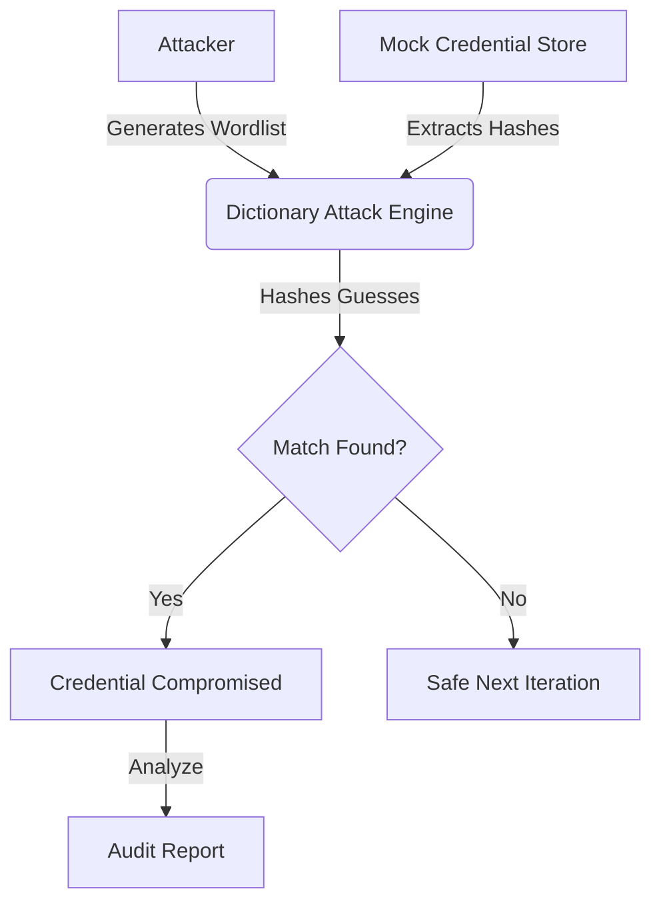

# Internal Security Audit Simulation Report
**Date**: 2026-01-26 10:53:28
**Scope**: Synthetic Credential Resilience Benchmark

## 1. Executive Summary
This simulation benchmarked the resilience of user credentials against standard dictionary and pattern-based attacks. The audit tested 6 mock identities and successfully demonstrated compromise pathways for heavily mutated passwords.

## 2. Attack Simulation Architecture
The following diagram illustrates the simulated data flow used to benchmark excessive risk:

## 3. Technical Findings & Risk Analysis
| User Identity | Password Found | Entropy | Algo | Policy | Est. Time | Risk |
|---|---|---|---|---|---|---|
| mock_user_1000 | `summer2025` | 51.7 | SHA-512 | FAIL | 4.23 days | **Moderate** |
| mock_user_1001 | `admin` | 23.5 | SHA-512 | FAIL | 0.0012 seconds | **Very Weak** |
| mock_user_1002 | `secure` | 28.2 | SHA-512 | FAIL | 0.0308 seconds | **Weak** |
| MockUser_1000 | `summer2025` | 51.7 | NTLM | FAIL | 4.23 days | **Moderate** |
| MockUser_1001 | `admin` | 23.5 | NTLM | FAIL | 0.0012 seconds | **Very Weak** |
| MockUser_1002 | `secure` | 28.2 | NTLM | FAIL | 0.0308 seconds | **Weak** |

## 4. Blue Team Defense Recommendations
**Critical Issue**: 4 identities used passwords classified as 'Weak' or 'Very Weak'.

### Immediate Actions:
- [ ] Enforce minimum length of 12 characters.
- [ ] Implement MFA (Multi-Factor Authentication) to mitigation credential theft.
- [ ] Check new passwords against a 'banned list' of common terms.

### Long-Term Strategy:
- [ ] Increase hashing iterations (e.g., use Argon2id with high cost).
- [ ] Ensure unique salts are at least 16 bytes for every user.

---
*Generated by Python Credential Audit Suite - Educational Use Only*